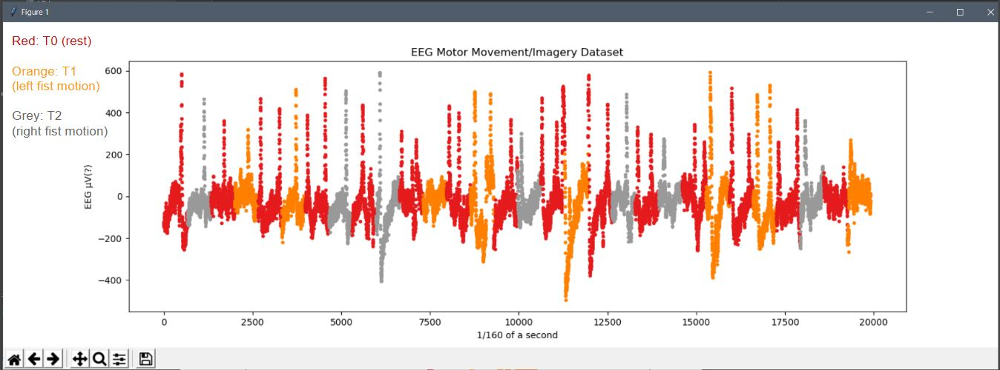
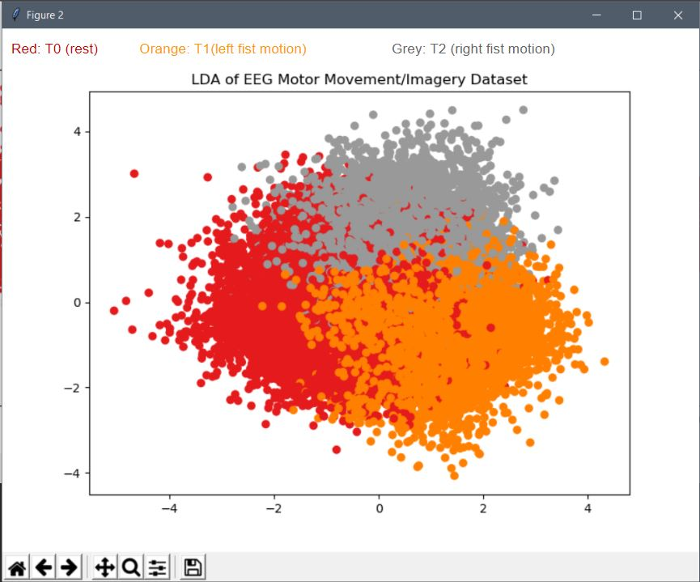

# LDA-on-EEG-Motor-Movement-Imagery-Dataset
Linear discriminant analysis on EEG Motor Movement/Imagery Dataset: https://www.physionet.org/pn4/eegmmidb/ 
One random channel (FpZ or 23)out of 64 channel:

     

Results after LDA (across all 64 channel) 

     

